<h1 align="center">Hi, I'm Misho 👋</h1>

  I build small, opinionated apps at the intersection of <b>knowledge, AI and analytics</b>: games, learning tools,
  simulators and trackers. Most of what's below is live, so click a screenshot and try it.

  
  

## 🎮 Playgrounds & games

<table>
<tr>
<td width="50%" valign="top">
<a href="https://history-maps-azure.vercel.app">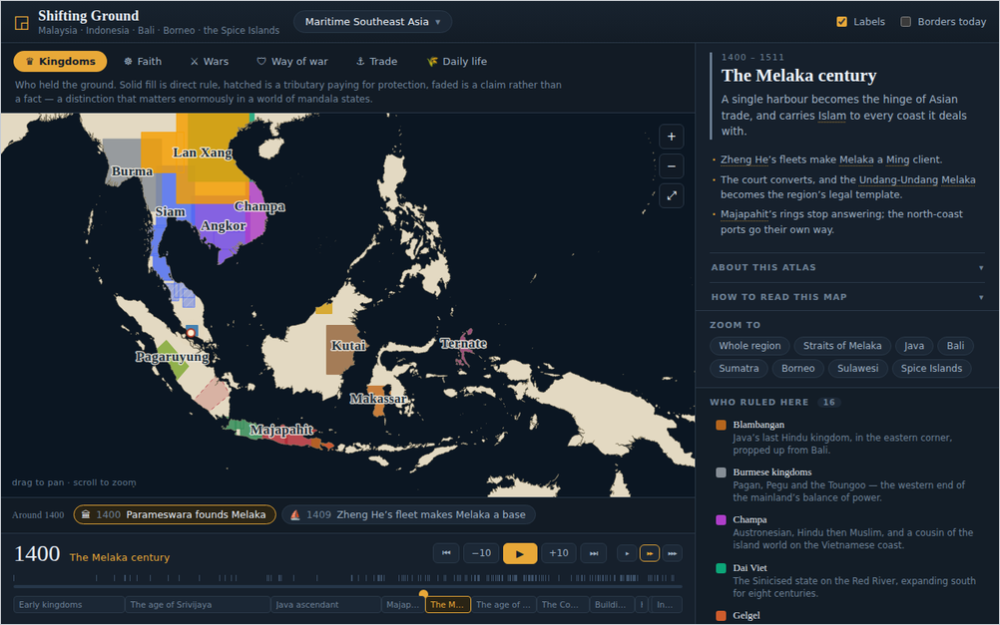</a>
 <b><a href="https://history-maps-azure.vercel.app">Shifting Ground</a></b> · an interactive historical atlas. Pick a year, press play, watch kingdoms change hands. Seven atlases, from Rome to Mesoamerica.
</td>
<td width="50%" valign="top">
<a href="https://mythology-nine.vercel.app">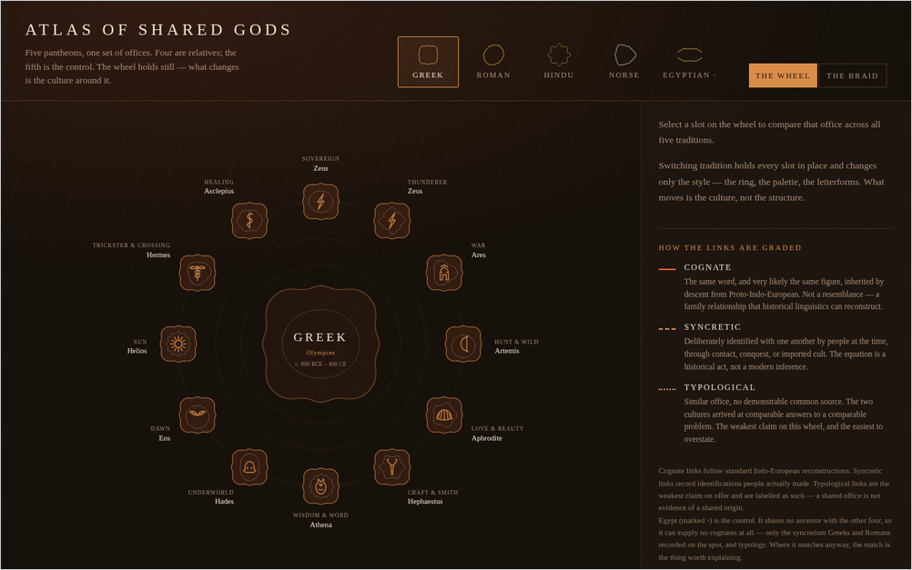</a>
 <b><a href="https://mythology-nine.vercel.app">Atlas of Shared Gods</a></b> · five pantheons on one wheel. Switch tradition and only the culture changes; the structure stays put. Hand-drawn SVG throughout.
</td>
</tr>
<tr>
<td width="50%" valign="top">
<a href="https://probability-five.vercel.app">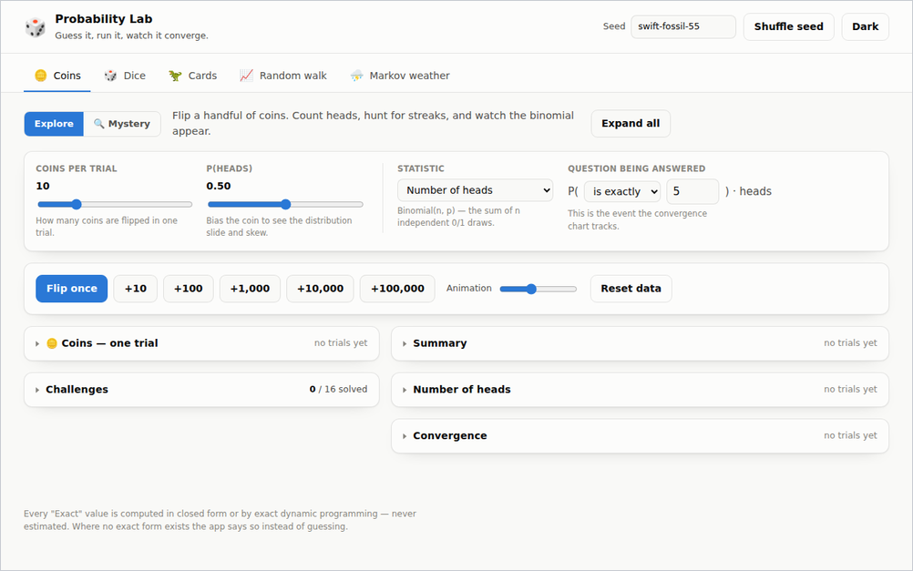</a>
 <b><a href="https://probability-five.vercel.app">Probability Lab</a></b> · flip coins, roll dice, walk random walks and watch the exact distribution converge with the simulated one. Mystery mode hides the process and makes you infer it.
</td>
<td width="50%" valign="top">
<a href="https://xd-adventure.vercel.app">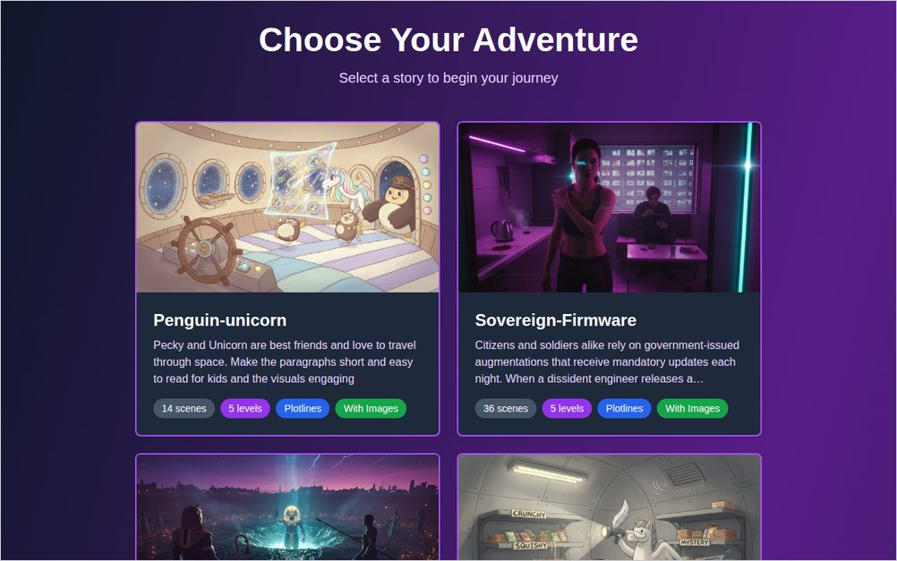</a>
 <b><a href="https://xd-adventure.vercel.app">Choose Your Own Adventure</a></b> · LLM-generated branching stories with illustrated scenes, exportable as printable cards for playing at the table.
</td>
</tr>
<tr>
<td width="50%" valign="top">
<a href="https://chroma-play-dusky.vercel.app">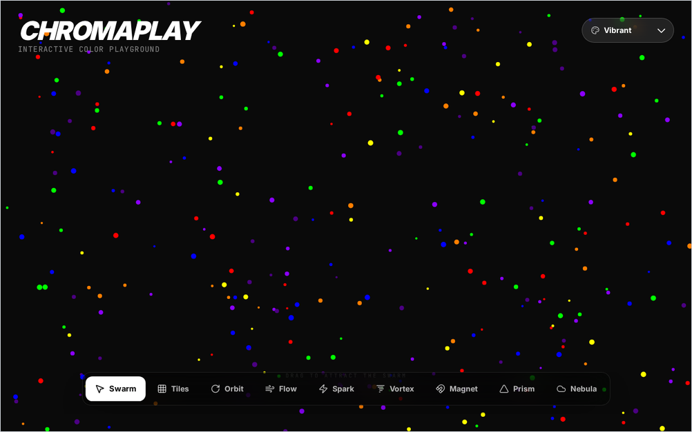</a>
 <b><a href="https://chroma-play-dusky.vercel.app">ChromaPlay</a></b> · an interactive colour playground. Swarm, orbit, vortex, magnet, prism: pick a mode and push the particles around.
</td>
<td width="50%" valign="top">
</td>
</tr>
</table>

More games: **[MD Logic](https://md-logic.vercel.app)** (nine mini games for logic, memory and language) · **[Splat Wars](https://rd-splat-wars.vercel.app)** (3D paint shooter) · **[Zenith Parking Jam](https://xd-parking-jam.vercel.app)** (sliding-block puzzle) · **[World Domination](https://md-world-domination.vercel.app)** (geopolitical strategy) · **[Sunny Town](https://rd-town.vercel.app)** (town builder)

## 🧰 Tools & trackers

<table>
<tr>
<td width="50%" valign="top">
<a href="https://github.com/md-experiments/ufo-files">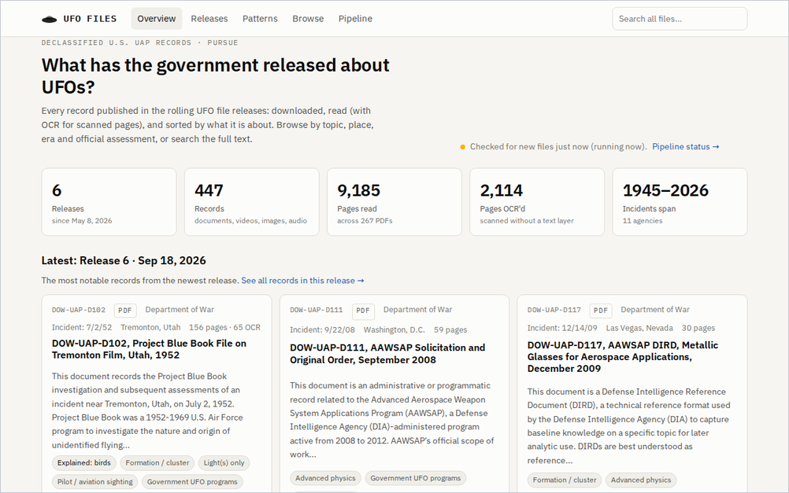</a>
 <b><a href="https://github.com/md-experiments/ufo-files">UFO Files Tracker</a></b> · follows the U.S. government's declassified UAP releases: downloads, OCRs and classifies every record, then mines the collection for waves and recurring details.
</td>
<td width="50%" valign="top">
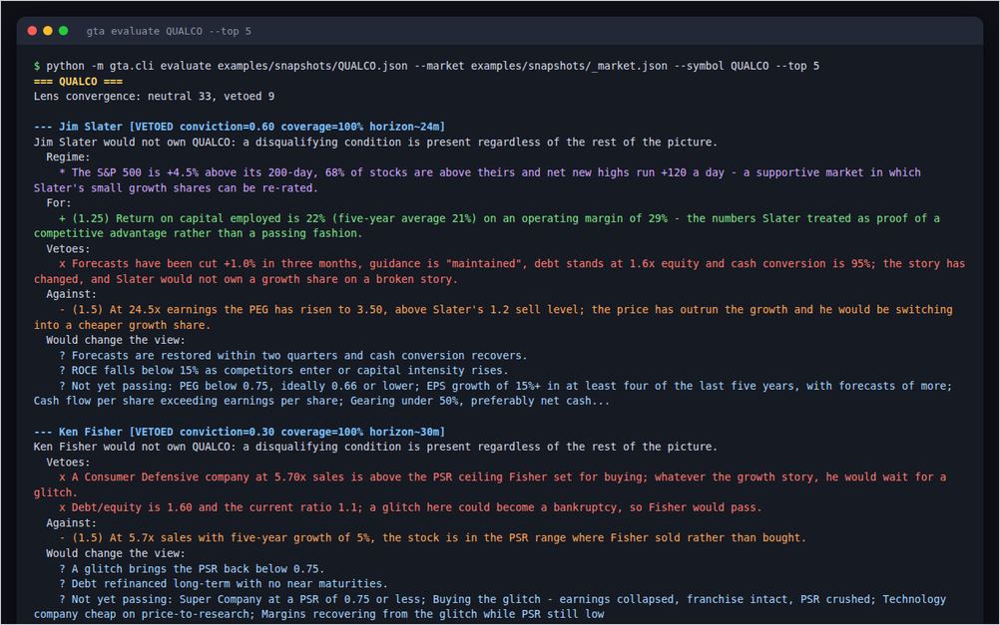
 <b>Great Trader Arguments</b> · what would Buffett, Graham, Slater or Fisher say about this stock today? Forty investors' rules as machine-evaluable triggers, argued in their own voice.
</td>
</tr>
<tr>
<td width="50%" valign="top">
<a href="https://www.diy-investor.net">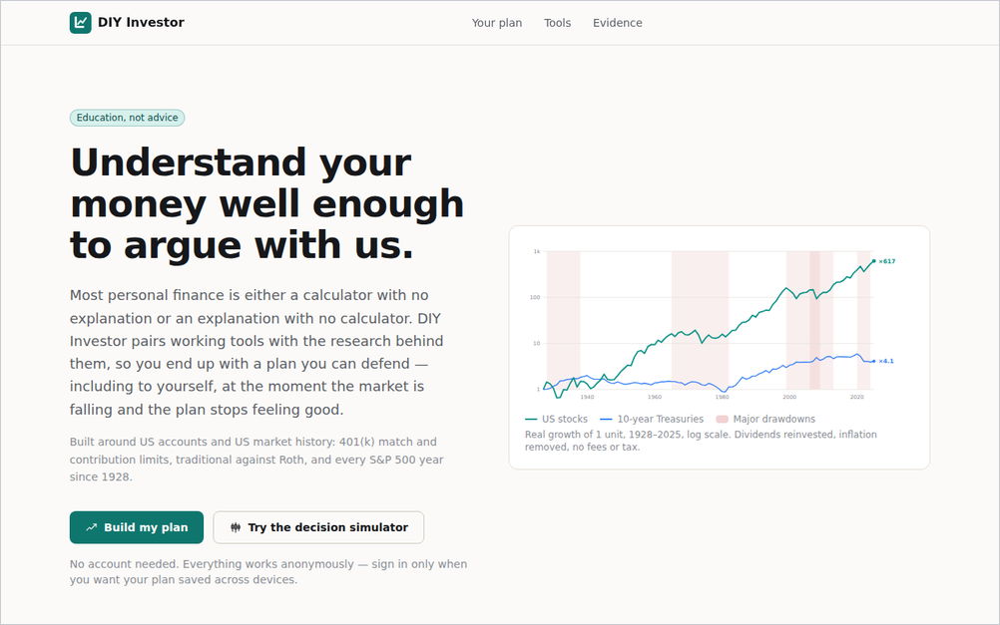</a>
 <b><a href="https://www.diy-investor.net">DIY Investor</a></b> · evidence-based personal finance tools. Every calculator and simulator is paired with the research behind it, so you can check the output rather than trust it.
</td>
<td width="50%" valign="top">
<a href="https://fin-pages.vercel.app">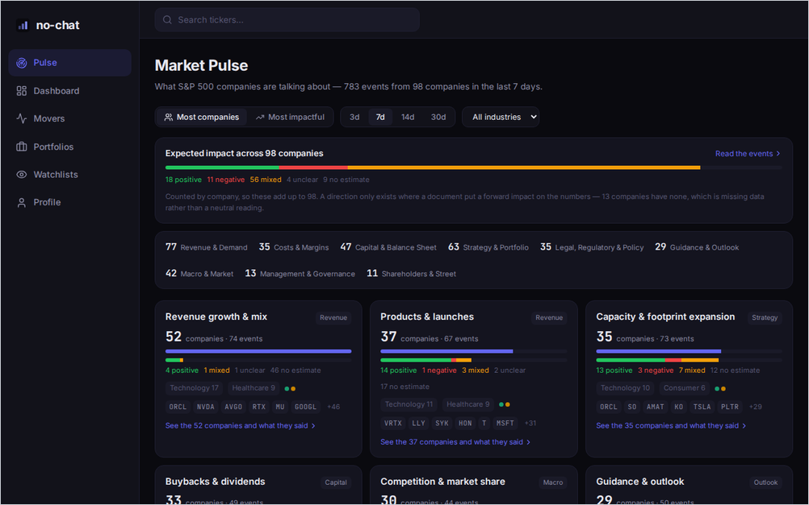</a>
 <b><a href="https://fin-pages.vercel.app">FinPages</a></b> · earnings filings, ranked and explained. A pipeline reads SEC 10-K / 10-Q filings and transcripts and turns them into scored events you can browse market-wide.
</td>
</tr>
<tr>
<td width="50%" valign="top">
<a href="https://balance-wheat-one.vercel.app">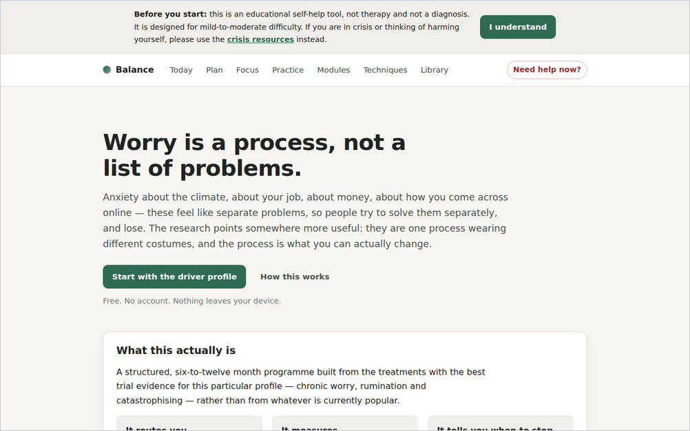</a>
 <b><a href="https://balance-wheat-one.vercel.app">Balance</a></b> · an evidence-led, private-by-design self-help programme for chronic worry and modern anxiety. No account, nothing leaves your device.
</td>
<td width="50%" valign="top">
<a href="https://preso-prep.vercel.app">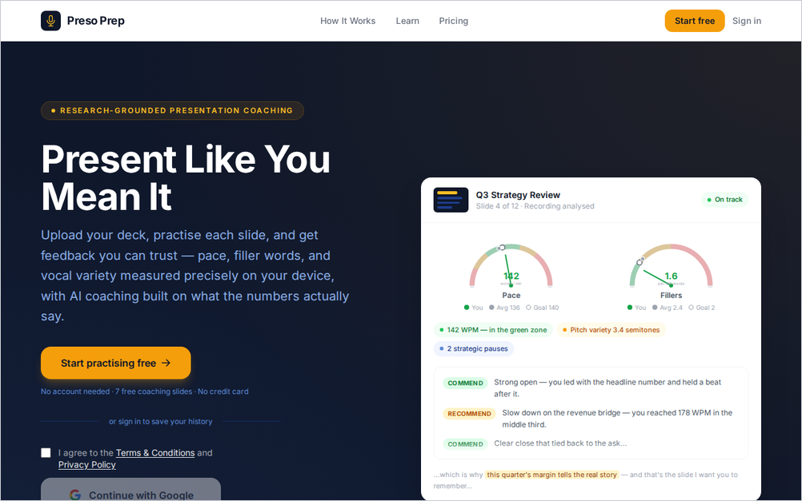</a>
 <b><a href="https://preso-prep.vercel.app">Preso Prep</a></b> · upload a deck, practise each slide out loud, and get feedback on pace, filler words, vocal variety and content coverage.
</td>
</tr>
<tr>
<td width="50%" valign="top">
<a href="https://viz-blog.vercel.app">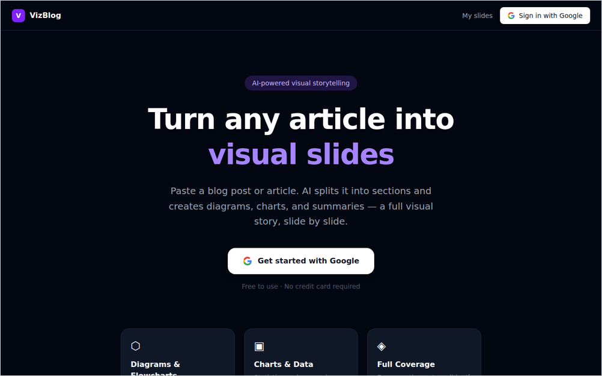</a>
 <b><a href="https://viz-blog.vercel.app">VizBlog</a></b> · paste an article and get a visual slide deck: diagrams, charts and summaries, section by section.
</td>
<td width="50%" valign="top">
</td>
</tr>
</table>

## 🔐 More apps (sign in to use)

- **[Lexis](https://e-reader-olive.vercel.app)** · a Kindle-style web e-reader for PDFs and EPUBs with highlights, table of contents and cross-device progress. [Source](https://github.com/md-experiments/e-reader).
- **[Endless Canvas](https://endless-canvas-lyart.vercel.app)** · an infinite canvas for dropping, clustering and connecting ideas. Works on desktop, iPad and phone.
- **[Idea Validator](https://idea-validation-omega.vercel.app)** · validate a business idea with AI-powered customer interviews and scoring before you build it.
- **[The Agora](https://chat-the-greats.vercel.app)** · chat with historically grounded personas of great thinkers, with passages from their own works cited inline.
- **[Memory](https://memory-kappa-taupe.vercel.app)** · spaced retrieval built on the techniques with evidence behind them: free recall, interleaving, a memory palace. Anki tests you; this trains you.
- **[Six Pillars](https://self-esteem-eight.vercel.app)** · a daily practice for self-esteem built on Nathaniel Branden's six pillars, with an emotion wheel and drag-to-pick exercises.
- **[Vibe Plus](https://vibe-plus-lime.vercel.app)** · a document editor that streams AI writing feedback as you type, across 26 kinds of analysis.
- **[Town Sim](https://md-town-sim.vercel.app)** · a pre-modern town run by LLM-driven citizens who work, fall in love, age and die. You just watch, and occasionally nudge.
- **[KD Menu](https://kd-menu.vercel.app)** · a family meal planner with prep steps, tags and search. **[Life Saver](https://life-saver-eight.vercel.app)** · a family life organiser.
- **[Genna 4](https://github.com/md-experiments/genna4)** · GENerative ANNotation: run several LLMs as annotators, spot where they disagree, grade them side by side. **[Happy Hanzy](https://github.com/md-experiments/happy-hanzy)** · learn Chinese characters from their radicals.

## 🌟 Earlier projects

  
  &nbsp;
  
  &nbsp;
  

- **[Picture Text](https://github.com/md-experiments/picture_text)** ⭐ turns a pile of documents into an interactive treemap using sentence embeddings and hierarchical clustering.
- **[Elastic Transformers](https://github.com/md-experiments/elastic_transformers)** is an easy-to-deploy semantic search library on Elasticsearch and sentence-transformers.
- **[Anna](https://github.com/md-experiments/anna)** is a simple data annotation tool; **[Genna 3](https://github.com/md-experiments/genna3)** was its LLM-centric successor.
- **[Password Vault](https://github.com/md-experiments/password_vault)** keeps passwords encrypted on disk and shows them only for a short window.
- **[simple-chat](https://github.com/md-experiments/simple-chat)** is a lightweight private ChatGPT-style UI; **[AI Storyteller](https://github.com/md-experiments/md-similacra)** writes, voices and renders a short video from one line.

## 🛠️ Tools I reach for

  

